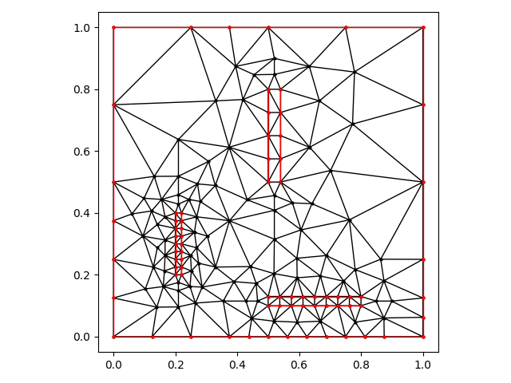

# Unstructured Mesh Refinement

This is a 2D unstructured mesh generation tool using Delaunay
triangulation and various refinement algorithms.

# Algorithms

The purpose of these refinement algorithms is to refine the mesh until
the minimum angle of all triangles exceeds an input value while
meeting the Delaunay criteria. The following algorithms are
implemented:

* Divide and Conquer -- Delaunay triangulation, used for
  initialization

* Chew Uniform -- A refinement algorithm initialized with a uniform
  mesh, guaranteeing minimum angles of at least 30 degrees.

* Chew Nonuniform -- Refinement algorithm with guaranteed convergence
  for minimum angles up to 26.5 degrees. Yields meshes only meeting
  constrained Delaunay criteria.

* Ruppert -- Refinement algorithm with guaranteed convergence for
  minimum angles up to 20.7 degrees. Yields meshes meeting Delaunay
  criteria.

* Terminator -- An algorithm guaranteeing convergence in input meshes
  with small angles. It is integrated in both the Chew Nonuniform and
  Ruppert refinement algorithms.

Other potentially useful tools in the library:

* Bowyer-Watson -- Delaunay triangulation algorithm
* Giftwrap -- Edge insertion algorithm
* QuadEdge data structure


# Features and Examples

### Density Fields

Density fields are used limit the max edge length. UMR is implemented
with methods to define uniform densities, use interpolator methods
using data from a CSV file, and use fields defined by functions. The
interpolator example below only defines a point in each corner of the
mesh. The function example uses a traveling sine function.

Uniform | Interpolator | Function
:------:|:------------:|:-------:
 |  |  

### Internal Sources

Internal sources can be set as an alternative to defining density
fields, typically fixing some lengthscale in a local region. Distances
between input source segments and points constrain the maximum edge
length when refining.  Below are examples using the three implemented
refinement algorithms. Red line segments are the input sources.

Chew Uniform | Chew Nonuniform | Ruppert
:-----------:|:---------------:|:-------:
 |  |  


### Small Input Angles

Small angles between input source segments are known to yield
convergence issues in refinement algorithms. Below is an example with
fixed, narrow angles internally, demonstrating the value of Terminator
algorithm to address this issue.

Delaunay Triangulation | Ruppert | Ruppert + Terminator
:---------------------:|:-------:|:--------------------:
 |  |  


# Usage

Compiling the code with cmake will compile both the library and the
examples. The examples are a very good place to start. Most notably
example 3 discusses the use of command line arguments used in it and
all following examples. Run the examples with the argument `-h` or
`--help` to see the current arguments allowed. Below are a few
examples.

```
./ex03_command_line --angle 20 --refinement ruppert
./ex03_command_line --density 0.05 --refinement chew-uniform
```

# Installation

## Requirements

This library was developed on Fedora and tested on both Ubuntu and
Windows Subsystems for Linux (WSL) for Ubuntu. The library uses the
[AlgLib Free Edition](https://www.alglib.net/) which will get
downloaded at compilation. Other dependencies must installed manually.
C++ v14+ is required.

### Fedora

```sudo dnf install cmake jsoncpp-devel boost-devel vtk-devel```

### Ubuntu and WSL

```sudo apt install cmake libjsoncpp-dev libboost1.83-all-dev libvtk9-dev```

## Code Compilation

From the library's root directory, run
```
cmake -B build -DCMAKE_BUILD_TYPE="Release"
cmake --build build -j
```

For debugging purposes, replace ```Release``` with ```Debug```.

After compilation, examples can be found in ```build/bin/examples```.

## Visualization

Any visualization software compatible with VTK should work the the
mesh data files, e.g. [Paraview](https://www.paraview.org/download/).

The included python plotting script can be used to plot both VTK and
json formats.

```python -m pip install vtk matplotlib```


# References

[Chew's Uniform algorithm](https://www.sandia.gov/files/samitch/unm_math_579/chew_guaranteed_triangular_89-983.pdf)

Chew, L. Paul. Guaranteed-quality triangular meshes. Cornell University, 1989.

[Chew's Nonuniform algorithm](https://dl.acm.org/doi/pdf/10.1145/160985.161150)

Chew, L. Paul. "Guaranteed-quality mesh generation for curved surfaces." Proceedings of the ninth annual symposium on Computational geometry. 1993.

[Ruppert's algorithm](https://dl.acm.org/doi/pdf/10.5555/313559.313615)

Ruppert, Jim. "A new and simple algorithm for quality 2-dimensional mesh generation." Proceedings of the fourth annual ACM-SIAM Symposium on Discrete algorithms. 1993.

[Shewchuck's Terminator algorithm](https://dl.acm.org/doi/pdf/10.1145/336154.336163)

Shewchuk, J. R. "Mesh generation for domains with small angles." Proceedings of the sixteenth annual Symposium on Computational Geometry. 2000.

[QuadEdge data structure](https://dl.acm.org/doi/pdf/10.1145/282918.282923)

Guibas, Leonidas, and Jorge Stolfi. "Primitives for the manipulation of general subdivisions and the computation of Voronoi." ACM transactions on graphics (TOG) 4.2 (1985): 74-123.
